# Agent Memory State v1 Architecture

## Purpose

The repository implements one narrowly scoped primitive: an authorized account
advances a private memory space from one committed state root to the next. Raw
memory remains outside the protocol.

## Protocol invariants

Every conforming implementation preserves these invariants:

1. A Space identifier is derived from its initial controller and a salt.
2. A Space is registered once and always has one controller and one authorizer.
3. The first accepted transition has sequence `1` and `prevStateRoot == ZERO32`.
4. Every later transition has `sequence == head.sequence + 1` and
   `prevStateRoot == head.stateRoot`.
5. `transitionId` is the EIP-712 `hashStruct` of exactly seven v1 fields.
6. `nextStateRoot` is computed by the registry, never supplied by the caller.
7. The configured authorizer approves every transition through ECDSA, EIP-1271,
   or a direct call from that same account.
8. A relayer cannot change any Delta field, including `locatorCommitment`.
9. Raw memory, salts, keys, and raw locators are not core calldata.

## Data flow

```mermaid
flowchart LR
    A["Memory engine"] --> B["Profile encoder"]
    B --> C["Salt or encrypt payload"]
    C --> D["Build ExperienceDelta v1"]
    D --> E["Compute transitionId"]
    E --> F["Authorizer signs EIP-712 digest"]
    F --> G["Relayer or authorizer submits"]
    G --> H["Registry checks Space, sequence, root, signature"]
    H --> I["Registry computes nextStateRoot"]
    I --> J["Indexers and auditors observe commitment"]
```



The private witness travels only between authorized off-chain systems. It is not
needed by the registry to enforce ordering or authorization.

## Layer boundaries

### Core

- `packages/core`: canonical types, hashes, EIP-712 domain, private commitment
  helpers, and JSON mapping.
- `contracts/src/interfaces`: normative Solidity interfaces.
- `contracts/src/reference`: dependency-light reference Registry.
- `contracts/src/reference/PrivateCommitment.sol`: internal-only cross-language
  commitment helper; it must not expose private bytes through transaction calldata.
- `test-vectors`: cross-language conformance inputs and outputs.

Core does not know about Awareness card types, memory markets, deletion, REC,
agent identity registries, or inference standards.

### Extensions

- `contracts/src/extensions/DeletionAttestation.sol`: records one scoped evidence
  commitment for a transition. It explicitly does not prove universal erasure.

Extensions may reference Space or Transition IDs but do not change core state.

### Experimental

- `contracts/src/experimental/MemoryMarket.sol`: a licensing experiment that
  invalidates stale listings when controller or state root changes.
- REC and cognition-asset research belongs in research documents until it has an
  independently reviewable interface.

Experimental code is excluded from the ERC's normative claims.

### Product adapters

- `packages/awareness-adapter`: maps Awareness cards and embeddings to private
  profile payloads and v1 transitions.
- Product profile names such as `TEXT`, `POLICY`, and `EMBEDDING` are adapter
  metadata, not protocol enums.

### Implementations

- `packages/reference-engine`: full off-chain reference state machine.
- `implementations/minimal-ts`: dependency-isolated hashing implementation. It
  intentionally does not import `@erc-awar/core`.

An implementation by a separate external team is still required to demonstrate
ecosystem adoption. The in-repository minimal implementation proves dependency
independence, not organizational independence.

## State model

```text
transitionId = hashStruct(ExperienceDelta)
nextStateRoot = keccak256(abi.encode(
  MEMORY_STATE_TYPEHASH,
  prevStateRoot,
  transitionId
))
```

The state root is an accumulator over all accepted transitions in a Space. The
protocol does not claim it is a Merkle root of raw memory. A profile may add a
Merkleized memory-state representation inside `deltaCommitment`.

## Authorization model

The controller is the administrative recovery authority. The authorizer is the
operational transition authority. They may be the same account.

- EOA: canonical 65-byte ECDSA signature.
- Contract wallet: EIP-1271 magic-value validation.
- Multisig or smart account: configured as authorizer through EIP-1271.
- Policy module: configured as authorizer if it implements EIP-1271.
- Relayer: pays gas but receives no authority.

Configuration updates are nonce-bound and signed by the current controller.

## Privacy model

The baseline is a domain-separated salted commitment. For low-entropy private
memory, use encrypted payload bytes and a fresh key/nonce before committing.
Public salts stop precomputed rainbow tables but do not stop targeted guessing.

The core signs a locator commitment instead of a URI. An authorized retriever
receives the locator and locator salt out of band and can verify the opening.

## Migration from prototype v0

Prototype records are not reinterpreted as v1 because their JCS and Solidity IDs
differ and their state relation was not enforced. Migration creates a new v1
Space and commits one private migration payload containing:

- the v0 export or its root;
- the v0 final record identifier;
- the migration tool/version; and
- any audit statement required by the deployment.

That migration transition is the v1 genesis. The old chain remains historical
evidence and is never silently rewritten.
